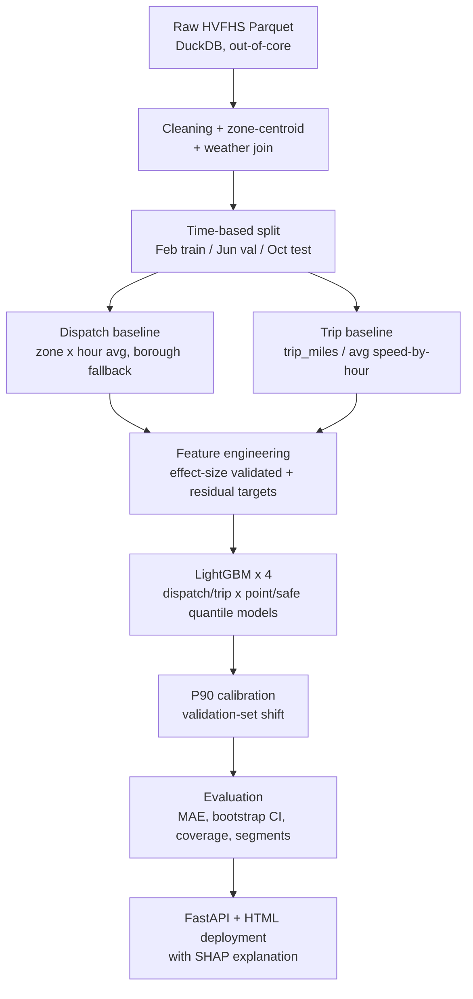

# Two-Leg Rideshare ETA — Residual-Corrected, Calibrated Prediction System

Predicts ride-hailing arrival times as **two separate predictions** — how long until
the driver arrives (dispatch), and how long the ride itself takes (trip) — instead of
one end-to-end guess. Trained on 55M real NYC rideshare trips, deployed as a working
prediction API with explainability and measured latency/throughput.

---

## In plain terms

When you book a ride, the app shows two numbers at two different moments: "driver
arriving in 4 min," then later "trip will take 18 min." These are genuinely different
problems — dispatch time depends on how many drivers are nearby, trip time depends on
distance and traffic — so this project builds them as two separate models instead of
forcing one model to learn both patterns at once.

Instead of predicting the ETA from scratch, each model predicts the **error** in a
simple baseline guess and corrects it — the same design Uber's production ETA system
(DeepETA) uses. Each prediction comes with a "likely" estimate and a calibrated "safe,
worst-realistic-case" estimate, so the uncertainty is honest instead of hidden.

---

## Architecture



---

## Why this isn't a standard ETA notebook

- **Two-leg decomposition** with per-leg feature availability — dispatch-leg features
  are computed from what's knowable at *request* time, trip-leg features from what's
  knowable at *pickup* time.
- **Residual correction, not raw prediction** — each model learns the *gap* from a
  baseline, not the ETA itself, mirroring Uber's DeepETA design.
- **Per-leg asymmetric loss chosen by evidence, not assumed.** Quantile regression's
  alpha *is* the business cost ratio between early/late errors. Testing showed
  alpha=0.65 helps the trip leg but hurts the dispatch leg (weaker residual signal
  once a strong baseline is subtracted) — so each leg uses a different, justified
  value, backed by bootstrap-CI evidence.
- **P90 estimates are calibrated, not just labeled.** Raw GBDT quantile regression
  measured 85% actual coverage against a 90% target — fixed with a validation-set
  calibration shift, verified on a true holdout.
- **Explainability that reconciles.** Uses LightGBM's native `pred_contrib` (exact
  TreeSHAP) — verified by hand that `base_value + contributions = prediction`.

---

## Real bugs found and fixed

| # | Bug | Impact | Fix |
|---|---|---|---|
| 1 | `tolls` / `shared_match_flag` used as features | Post-outcome fields, not knowable pre-trip — leakage | Replaced with pre-trip proxies (`toll_route_pct`, `shared_request_flag`) |
| 2 | Zone-pair "recent activity" feature | p90 gap of 5.6 hours between observations — stale data labeled as current | Rebuilt at zone level (p90 gap: 15 min) |
| 3 | Dispatch features keyed on `pickup_datetime` | 30.4% of rows had a different 15-min bucket vs. `request_datetime`, the only time known at serving | Full rebuild keyed on `request_datetime` |
| 4 | Category dtype mismatch at deploy time | Zone IDs trained as integers, exported as strings — would silently misclassify every zone as unseen | Explicit type coercion at API load time |

---

## Data

[NYC TLC High-Volume For-Hire Services (HVFHS)](https://www.nyc.gov/site/tlc/about/tlc-trip-record-data.page) —
real, publicly released Uber/Lyft/Via/Juno trip data.

| | |
|---|---|
| **Period** | Feb, Jun, Oct 2024 (seasonal spread) |
| **Rows** | ~54.7M after cleaning (91.9% retention from 59.5M raw) |
| **Split** | Time-based — Feb train, Jun val, Oct test (not random) |
| **Key fields** | `request_datetime`, `pickup_datetime`, `dropoff_datetime`, pickup/dropoff zone, `trip_miles`, tolls, shared-ride flag |

**Known limitations:**
- No raw GPS — TLC anonymizes to 263 zones; distance uses zone-centroid straight-line estimates.
- No driver starting location — the dispatch leg has no distance signal at all, hence a statistical (not physics) baseline.
- "Recent zone activity" approximates real-time signal via 15-minute historical buckets — no live GPS feed exists in this public dataset.

---

## Results (test set, true holdout)

| Leg | Baseline MAE | Model MAE | Improvement | 95% CI |
|---|---|---|---|---|
| Dispatch | 106.1s | 103.3s | +2.79s (2.6%) | [2.65, 2.93] |
| Trip | 450.1s | 202.6s | +247.5s (55%) | [245.2, 249.8] |

P90 empirical coverage on test: dispatch 91.4%, trip 89.5% (target: 90%).

**Segment finding:** biggest win on structurally atypical routes — EWR (airport) trips
saw baseline MAE of 2249s cut to 434s (81% reduction), since a flat hourly-average-speed
baseline badly misjudges highway-heavy routes.

---

## Latency and throughput

Bug found and fixed here too: the original endpoint made 6 LightGBM calls per request
(computing each point prediction twice). Removing the redundancy, then adding
multi-worker deployment to exploit available cores, compound into a real result:

| Configuration | Sequential p50 | Concurrent throughput | Concurrent p50 (n=20) |
|---|---|---|---|
| Buggy (redundant calls), 1 worker | 71.7ms | 7.7 req/sec | 2427.5ms |
| Fixed calls, 1 worker | 59.0ms | 14.2 req/sec | 1183.8ms |
| Fixed calls, 4 workers | 54.3ms | **85.7 req/sec** | **219.5ms** |

4-worker capacity ceiling under a concurrency sweep: ~78-79 req/sec (~3.3x scaling —
sub-linear due to shared resource overhead, not a bug).

---

## Requirements
fastapi
uvicorn[standard]
lightgbm
pandas
numpy
Python 3.9+ (uses `typing.Optional`, not the `|` union syntax, for broader compatibility).

## Project structure
```
rideshare-eta/
├── models/ trained LightGBM models, calibration, category encodings
├── lookups/ baseline & feature lookup tables (zone×hour, speed, tolls)
├── static/
│ └── index.html simple web UI
├── app.py FastAPI backend
├── load_test.py latency/throughput benchmark script
├── requirements.txt
└── README.md
```

## How to run

```bash
pip install -r requirements.txt
uvicorn app:app --workers 4
```

Open `http://127.0.0.1:8000`. For development (auto-reload, not representative of real
performance), use `uvicorn app:app --reload` instead — single-worker only.

## API

| Endpoint | Method | Description |
|---|---|---|
| `/zones` | GET | List of valid pickup/dropoff zones |
| `/categories` | GET | Valid company codes; which zones are valid as pickup vs. dropoff (e.g. EWR has no pickup history) |
| `/predict` | POST | Pickup/dropoff zone, request time, company, weather, shared-ride flag, optional real distance → P50/P90 for both legs + per-feature explanation |
| `/health` | GET | Basic liveness check |

## Limitations

- Trip distance defaults to a straight-line (haversine) estimate unless
  `trip_miles_override` is passed — no routing engine, since no raw GPS exists in the
  source data.
- "Recent zone activity" uses a frozen historical snapshot, not a live feed.
- Combined "total ETA" P90 is an approximate sum of both legs' P90s, not the exact P90
  of their joint distribution.
- Hyperparameters were set by evidence-driven manual tuning, not a full Optuna search —
  scoped down given local compute constraints during training.
