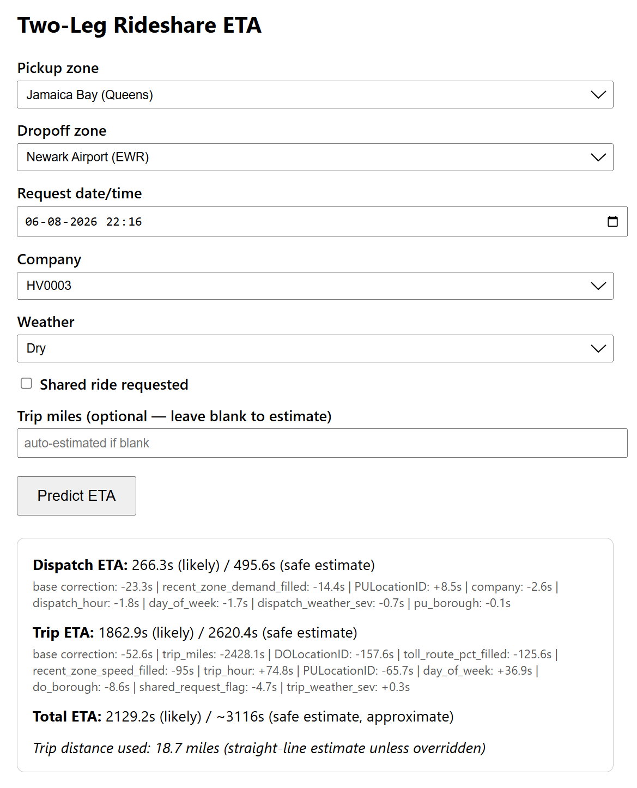

# Two-Leg Rideshare ETA

A residual-correction ETA system for ride-hailing trips, built on NYC TLC's public High-Volume For-Hire Vehicle (HVFHS) data — the same trip records underlying Uber, Lyft, Via, and Juno in NYC. Predicts two independent legs of a ride (dispatch wait and trip duration) separately, each as a historical baseline corrected by a LightGBM residual model, with calibrated P50/P90 estimates and per-prediction explainability.



## Why two legs, not one number

A rider's total wait has two physically different components: how long until a driver arrives (dispatch), and how long the ride itself takes (trip). These depend on different things — dispatch depends on local driver supply; trip depends on route and traffic conditions. Modeling them separately, then composing the total, turned out to matter: the two legs' prediction errors are **nearly uncorrelated (r = 0.06)**, so the composed total ETA error (276.7s MAE) comes in **21% below** the naive sum of each leg's individual error (348.4s) — independent error sources partially cancel rather than stack.

## Dataset

**54,693,307** filtered NYC TLC HVFHS trips across February, June, and October 2024 (chosen for temporal spread — winter/summer/fall), split 17.9M train / 18.5M val / 18.3M test by month. Filtered for sane dispatch duration (≤15 min), sane trip duration (3.3–71.5 min), and mileage-vs-haversine sanity checks to remove corrupted GPS/mileage records.

## Architecture

```
Dispatch leg (request → pickup)          Trip leg (pickup → dropoff)
┌─────────────────────────────┐          ┌─────────────────────────────┐
│ Baseline: zone-hour historical│          │ Baseline: OSRM road-network │
│ avg dispatch time             │          │ route duration (real routing│
│ (borough-hour fallback for    │          │ engine, not raw distance)   │
│ thin zones)                   │          │                              │
├─────────────────────────────┤          ├─────────────────────────────┤
│ LightGBM residual model       │          │ LightGBM residual model     │
│ (quantile objective,          │          │ (quantile objective,        │
│  P50 + P90, calibrated)       │          │  P50 + P90, calibrated)     │
└─────────────────────────────┘          └─────────────────────────────┘
              │                                        │
              └──────────────┬─────────────────────────┘
                              ▼
                    Composed total ETA
             (predicted dispatch + predicted trip)
```

**Features per leg:**
- **Dispatch:** pickup zone, borough, company (Uber/Lyft/Via), weather severity, hour, day of week, holiday flag, recent zone demand (15-min lagged, train-only fill)
- **Trip:** pickup/dropoff zone and borough, weather severity, hour, day of week, holiday flag, **OSRM road-network distance and duration**, toll-route history (train-only), shared-ride request flag

## Key engineering decisions

**Real road-network distance, not raw trip mileage.** An earlier version used the dataset's own recorded `trip_miles` — the actual path driven, which isn't knowable at request time and optimistically leaks trip-specific information (detours, actual route taken) into the baseline. Replaced with an OSRM-computed zone-to-zone distance/duration matrix — 69,169 pairs, batch-computed via OSRM's Table service against zone centroids, cached once rather than queried per trip. This reflects what a real routing system would know *before* the trip happens.

**Spatial generalization, measured with a proper holdout — not assumed.** A single random 10%-zone holdout initially suggested a ~25.6% degradation on unseen zones; a cheap multi-seed check without actually retraining suggested a misleadingly small ~3.9%. Neither was trustworthy. The rigorous version — 5 independent runs, each retraining a fresh model with a different 10% of zones genuinely excluded from training — gives **18.1% ± 5.6%** relative MAE degradation on trips touching unseen zones. That's the real number, with an honest confidence interval.

**Calibration performed without touching the test set.** P90 quantile shift is computed and validated entirely on the validation split; the test set is only used for final, one-time reported metrics.

## Limitations

- **OSRM reflects today's road network**, applied retrospectively to 2024 trips — not a historical reconstruction of road conditions as they existed on each trip's actual date.
- **No live traffic.** OSRM gives static road-network distance/duration; a production system would layer real-time congestion on top of this.
- **No live driver GPS.** Dispatch-leg predictions rely on historical zone-level patterns, not actual driver positions at request time — this data doesn't include driver location.
- **`is_holiday` is fixed at 0 in live serving.** Training used three specific 2024 dates as a holiday proxy; matching that against future request dates isn't meaningful, so the feature exists in the model but is inactive at inference time.
- **Public TLC data, not proprietary platform data.** This reconstructs what's observable from public trip records — no access to real dispatch-matching internals, live incentive systems, or GPS trajectories.
- **~18% relative error increase on entirely unseen zones** (measured, see above) — the model relies partly on zone-specific historical patterns that don't transfer to new locations.

## Results

| Metric | Baseline | Model |
|---|---|---|
| Dispatch MAE | (historical zone-hour avg) | see `dispatch_by_borough.png` |
| Trip MAE | (OSRM baseline duration) | see `trip_by_borough.png` |
| Composed total MAE | 348.4s (naive sum) | **276.7s** (21% better) |
| P90 coverage | — | calibrated to ~90% on val, held on test |
| Spatial holdout gap | — | 18.1% ± 5.6% (5-seed) |

Bootstrap 95% confidence intervals on MAE improvement, and per-segment error breakdown (by borough, hour, weather), are in the evaluation notebook.

## Setup

```bash
git clone https://github.com/varshitthhh/residual-eta.git
cd residual-eta
pip install -r requirements.txt
```

## Running the app

```bash
uvicorn app:app --reload
```

Then open `http://127.0.0.1:8000` in a browser. The frontend lets you pick pickup/dropoff zones, request time, company, weather, and whether the ride is a shared-ride request, then returns calibrated P50/P90 estimates for both legs plus a per-feature contribution breakdown.

**Note:** `python app.py` alone will not start the server — `app.py` defines the FastAPI app but has no `__main__` entrypoint. Always run via `uvicorn`.

## API

### `GET /health`
Liveness check. Returns `{"status": "ok"}`.

### `GET /zones`
Returns all NYC TLC taxi zones as `[{location_id, zone, borough}, ...]`.

### `GET /categories`
Returns valid categorical values for the frontend to populate dropdowns: `company`, `valid_pickup_zones`, `valid_dropoff_zones`.

### `POST /predict`

**Request body:**
```json
{
  "pickup_zone": 79,
  "dropoff_zone": 236,
  "request_datetime": "2026-08-28T13:30:00",
  "company": "HV0003",
  "weather": "dry",
  "shared_request": false
}
```

| Field | Type | Notes |
|---|---|---|
| `pickup_zone` / `dropoff_zone` | int | NYC TLC LocationID, must exist in training data |
| `request_datetime` | string | ISO 8601 |
| `company` | string | e.g. `"HV0003"` (Uber), `"HV0005"` (Lyft) |
| `weather` | string | `dry` \| `light_rain` \| `heavy_rain` \| `snow` |
| `shared_request` | bool | whether the rider requested a shared/pooled ride |

**Response:**
```json
{
  "dispatch_eta_seconds": {"p50": 210.9, "p90": 392.4},
  "trip_eta_seconds": {"p50": 2213.0, "p90": 2577.1},
  "total_eta_seconds": {"p50": 2423.8, "p90_approx": 2969.5},
  "osrm_distance_m_used": 8673.4,
  "osrm_duration_s_used": 840.2,
  "dispatch_explanation": {
    "base_value_seconds": 20.9,
    "feature_contributions": [
      {"feature": "PULocationID", "contribution_seconds": -9.2},
      {"feature": "company", "contribution_seconds": -5.1}
    ]
  },
  "trip_explanation": { "...": "same structure as above" }
}
```

`dispatch_explanation` / `trip_explanation` come from LightGBM's native `pred_contrib` output — mathematically equivalent to TreeSHAP for tree models — so `base_value + sum(contributions) == the P50 prediction`, exactly.

**Error responses** (HTTP 400) are returned for: unknown zone IDs, unrecognized categorical values not seen in training, or a zone pair with no OSRM route available.

## Common errors

| Error | Cause | Fix |
|---|---|---|
| `Unknown pickup_zone / dropoff_zone` | Zone ID not in the training data | Use `/zones` to get valid IDs |
| `Unknown value '...' for '...'` | Categorical value (company/weather) not seen in training | Check `/categories` for valid values |
| `No OSRM route data for zone pair` | Zone pair missing from the precomputed matrix (rare — should not happen for any two valid zones) | Verify `lookups/osrm_zone_matrix.csv` is present and complete |
| App fails to start, `FileNotFoundError` on a lookup CSV | Missing file in `lookups/` or `models/` | Confirm all files from `models/` and `lookups/` are present — see repo structure below |

## Repo structure

```
rideshare-eta/
├── app.py                       # FastAPI serving app
├── static/index.html            # frontend
├── models/                      # trained LightGBM models + calibration + category levels
├── lookups/                     # precomputed baselines, OSRM matrix, zone metadata
├── generate_latency_chart.py    # produces latency/throughput charts
├── generate_segment_chart.py    # produces per-segment error charts
├── load_test.py                 # concurrency/throughput benchmarking
└── requirements.txt
```

## Latency & throughput

Benchmarked via `load_test.py` — see `concurrency_sweep.png` and `throughput_comparison.png` for single-worker vs. multi-worker throughput ceilings. A redundant duplicate-model-call bug was found and fixed during benchmarking, roughly doubling throughput.